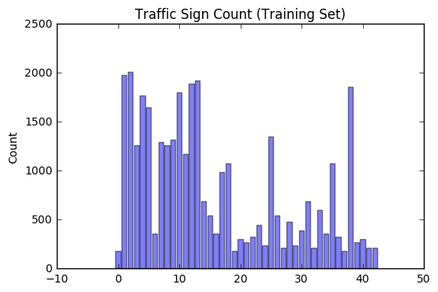
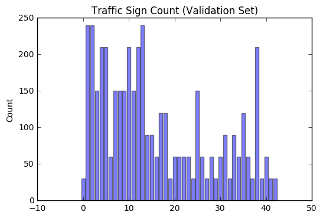
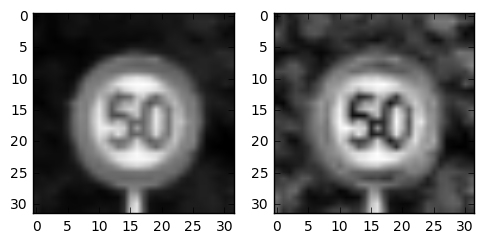

# **Traffic Sign Recognition** 

## Writeup

### Data Set Summary & Exploration

#### 1. Provide a basic summary of the data set. In the code, the analysis should be done using python, numpy and/or pandas methods rather than hardcoding results manually.

I used the pandas library to calculate summary statistics of the traffic signs data set:

* The size of training set is = 34799
* The size of the validation set is = 4410
* The size of test set is = 12630
* The shape of a traffic sign image is = (32,32,3)
* The number of unique classes/labels in the data set is = 43

#### 2. Include an exploratory visualization of the dataset.

Here is an exploratory visualization of the data set. As is evident from the bar chart, the distribution of classes is similar in training, validation and testing datasets. 

### Design and Test a Model Architecture

#### 1. Describe how you preprocessed the image data. What techniques were chosen and why did you choose these techniques? Consider including images showing the output of each preprocessing technique. Pre-processing refers to techniques such as converting to grayscale, normalization, etc. (OPTIONAL: As described in the "Stand Out Suggestions" part of the rubric, if you generated additional data for training, describe why you decided to generate additional data, how you generated the data, and provide example images of the additional data. Then describe the characteristics of the augmented training set like number of images in the set, number of images for each class, etc.)

To preprocess the images, I used Contrast Limited Adaptive Histogram Equalization (CLAHE) which divides the image into small blocks and each of these blocks are histogram equalized. This improves the contrast of the image by
distributing the intensities and allows areas of lower local contrast to gain a higher contrast. In our use case, it increased the brightness of the traffic signs in the middle, so the network could learn better features. CLAHE is always applied to greyscale images. Further, I normalized the image pixels by dividing each of them by 255. I also experimented with augmentation by rotating and scaling but to my disappointment the validation accuracy decreased (maybe something was wrong in the way I was doing it). Eventually, I stuck with CLAHE as the only pre-processing technique applied.
Here is an example of an original image and a pre-processed image (both are greyscale images):

 

#### 2. Describe what your final model architecture looks like including model type, layers, layer sizes, connectivity, etc.) Consider including a diagram and/or table describing the final model.

The model architechture is similar to LeNet. 

| Layer         		|     Description	        					| 
|:---------------------:|:---------------------------------------------:| 
| Input         		| 32x32x1 Greyscale image   	| 
| Convolution 5x5     	| 1x1 stride, valid padding, no. of filters=6, outputs 28x28x6 |
| ELU					|	Exponential Linear Units		|
| Max pooling	      	| 2x2 window, 2x2 stride,  outputs 14x14x6 				|
| Convolution 5x5	    |1x1 stride, valid padding, no. of filters=16, outputs 10x10x16 |
| ELU					|	Exponential Linear Units		|
| Max pooling	      	| 2x2 window, 2x2 stride,  outputs 5x5x16				|
| Fully connected		| Input = 400 (Flatten output from previous layer), Output = 120 |
| ELU					|	Exponential Linear Units		|
| Fully connected		| Input = 120 , Output = 84 |
| ELU					|	Exponential Linear Units		|
| Fully connected		| Input = 84, Output = 10 		|

 
#### 3. Describe how you trained your model. The discussion can include the type of optimizer, the batch size, number of epochs and any hyperparameters such as learning rate.

Following are the values of different hyperparameters:

Learning rate= 0.01  
Number of epochs= 60   
Optimizer= Adam   
Batch size= 128   
Activation function= Exponential Linear Unit

#### 4. Describe the approach taken for finding a solution and getting the validation set accuracy to be at least 0.93. Include in the discussion the results on the training, validation and test sets and where in the code these were calculated. Your approach may have been an iterative process, in which case, outline the steps you took to get to the final solution and why you chose those steps. Perhaps your solution involved an already well known implementation or architecture. In this case, discuss why you think the architecture is suitable for the current problem.

The model is based on the LeNet architechture. In the paper by Yan LeCun, the architechture taken as input a 32x32 image and performs really well. The size of our input image is the same and thus it served as a good starting point for this project. It's success is evident by the training set accuracy which is 99.8%. The validation set accuracy is 97.5% and the test set accuracy is 95.4%. Also, I computed the precision, recall and fscore for every class.
 

### Test a Model on New Images

#### 1. Choose five German traffic signs found on the web and provide them in the report. For each image, discuss what quality or qualities might be difficult to classify.

Here are five German traffic signs that I found on the web:

  
 

The fourth image (pedestrians) might be difficult to classify because the pedestrian class has the lowest precision, recall and fscore. 

#### 2. Discuss the model's predictions on these new traffic signs and compare the results to predicting on the test set. At a minimum, discuss what the predictions were, the accuracy on these new predictions, and compare the accuracy to the accuracy on the test set (OPTIONAL: Discuss the results in more detail as described in the "Stand Out Suggestions" part of the rubric).

Here are the results of the prediction:

| Image			        |     Prediction	        					| 
|:---------------------:|:---------------------------------------------:| 
| Yield      		| Yield   									| 
| Stop     			| General Caution 										|
| No Entry					| No Entry											|
| Pedestrians	      		| Right-of-way at the next intersection					 				|
| Speed Limit (60km/hr)			| Speed Limit (60km/hr)      							|

The model was able to correctly guess 3 of the 5 traffic signs, which gives an accuracy of 60%. The pedestrain image was expected to have a wrong prediction. The correct label is not even present in the top 5 predictions for the image. The 'stop' image has the correct label with the second-highest probability, so it fares better as comapred to the pedesntrian image.  

#### 3. Describe how certain the model is when predicting on each of the five new images by looking at the softmax probabilities for each prediction. Provide the top 5 softmax probabilities for each image along with the sign type of each probability. (OPTIONAL: as described in the "Stand Out Suggestions" part of the rubric, visualizations can also be provided such as bar charts)

The code for making predictions on my final model is located in the 21st and 22nd cell of the Ipython notebook.

For the first image, the model is 100% sure that this is a stop sign, and the image does contain a stop sign. Every other probability is zero. 

For the second image, the model is relatively sure that this is a 'General Caution' sign, but it is actually NOT. The correct label is the second one. 

| Probability         	|     Prediction	        					| 
|:---------------------:|:---------------------------------------------:| 
| .60         			| General Caution   									| 
| .40     				| Stop 										|
| .00					| Turn Left Ahead											|
| .00	      			| Keep Right					 				|
| .00				    | Ahead Only      							|

For the third image, the model is 100% sure that this is a 'No Entry' sign, and it is the correct prediction. Every other probability is zero. 

For the fourth image, the model is relatively sure that this is a 'Right-of-way at the next intersection' sign, but it is actually NOT. The correct label is not present in top 5 predictions. 

| Probability         	|     Prediction	        					| 
|:---------------------:|:---------------------------------------------:| 
| .92         			| Right-of-way at the next intersection   									| 
| .07     				| General Caution 										|
| .01					| Traffic Signals											|
| .00	      			| Roundabout Mandatory					 				|
| .00				    | Vehicles over 3.5 tons prohibited      							|

For the last image, the model is 100% sure that this is a 'Speed Limit (60km/hr)' sign, and it is the correct prediction. Every other probability is zero.

